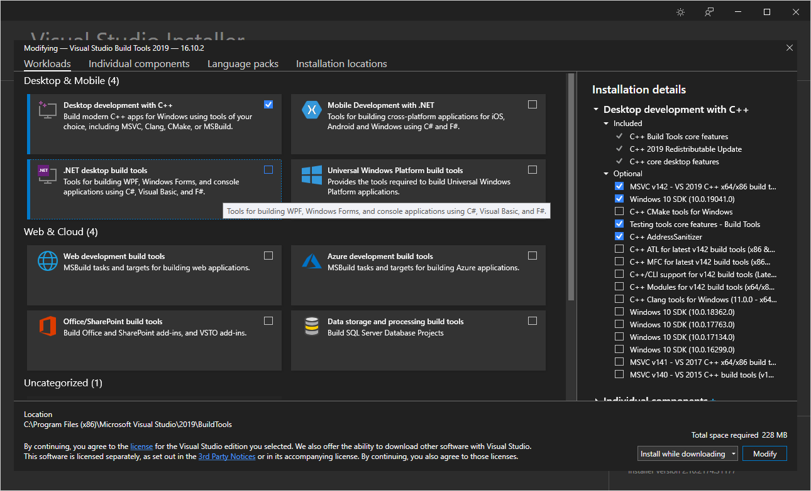
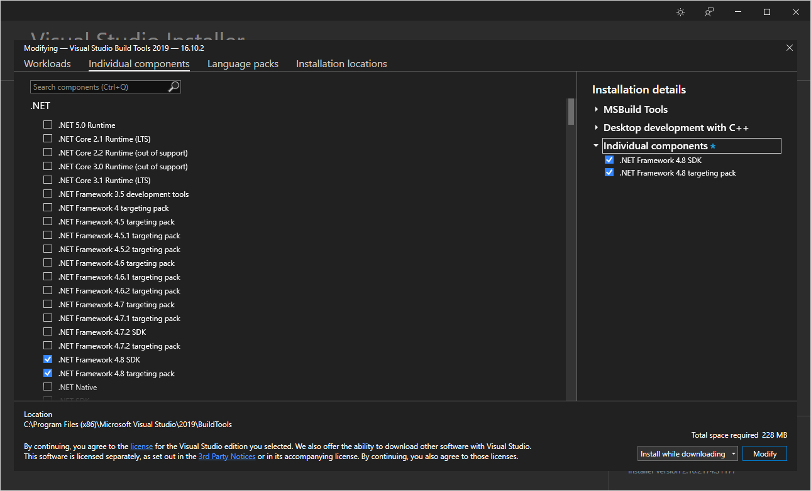

# SummerGameProject
A game project made in Unreal.

## Compilation / Opening the project for the first time

At the minimum, you may need to install the 
[Build Tools for Visual Studio](https://visualstudio.microsoft.com/downloads/#build-tools-for-visual-studio-2019)
or the full 
[Visual Studio 2019](https://visualstudio.microsoft.com/downloads/)
(with the IDE) to be able to compile the project.

If you are installing the Build Tools, you will need to select Desktop
development with C++ under the ``Workloads`` tab.

As well as a version of the .NET Framework SDK greater than 4.6 under the
``Individual Components`` tab.

Unreal should then be able to compile the project source after prompting you to
rebuild the missing modules.
